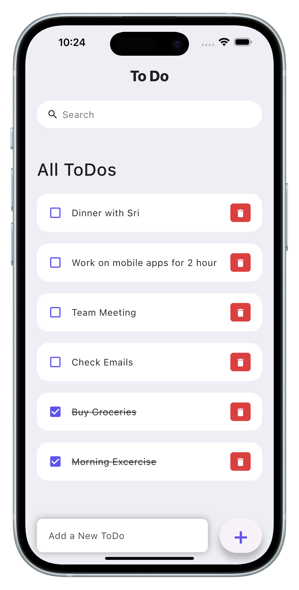

# ✅ To-Do App

A Flutter-based mobile application that helps users manage their daily tasks effectively.  
It demonstrates core Flutter concepts like state management, local storage, and responsive UI.

  

## Project Description

- **Add New To-Do**: Quickly add new tasks.
- **Delete To-Do**: Remove tasks when completed or not needed.
- **Search To-Do**: Find tasks instantly with the built-in search.
- **Edit To-Do**: Update tasks with new information.
- **Offline Functionality**: Works without internet, all data stored locally.
- **Static App**: This is a static app that doesn't require any user authentication.
- **Local Data Storage**: All data present in the app will be stored locally on the device.

## Features

- ➕ Add new tasks  
- 🗑 Delete tasks  
- 🔍 Search tasks  
- ✏️ Edit tasks  
- 📱 Responsive design  
- 💾 Local data storage  
- 🌐 Works offline  

## Flutter Version

This project uses **Flutter version 2.1.0**.

## How to Run

1. Make sure you have Flutter installed. You can download it from [Flutter's official website](https://flutter.dev/docs/get-started/install).
2. Clone this repository.
3. Navigate to the project directory.
4. Run `flutter pub get` to install all dependencies (requires internet).
5. Verify that dependencies are installed successfully.
6. Run `flutter run` to launch the app on your device or emulator.

## Documentation

- [Flutter Documentation](https://docs.flutter.dev/)
- [Flutter Samples](https://docs.flutter.dev/samples)
- [Flutter API Reference](https://api.flutter.dev/)